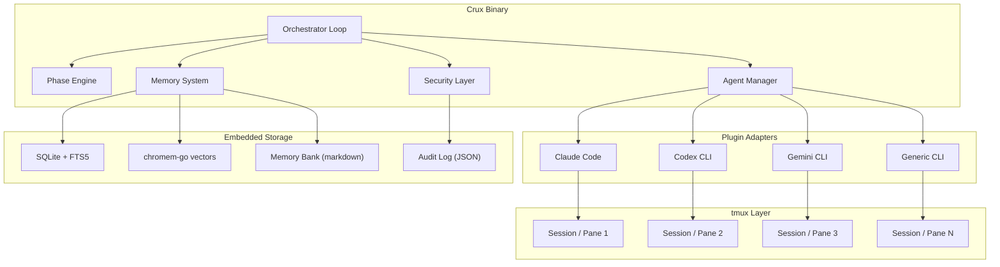
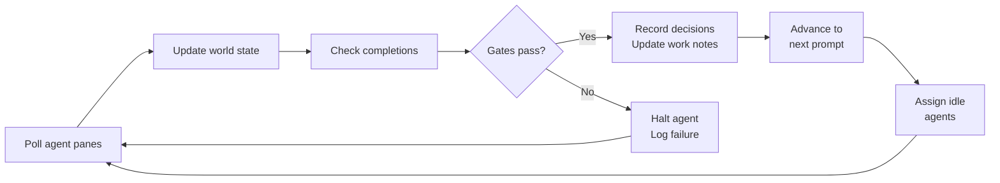
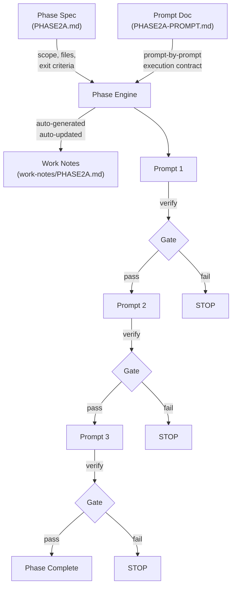
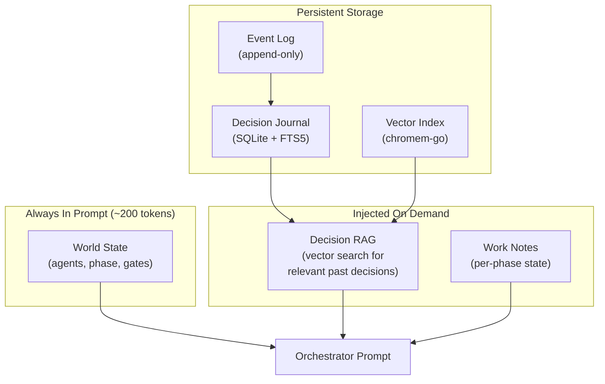
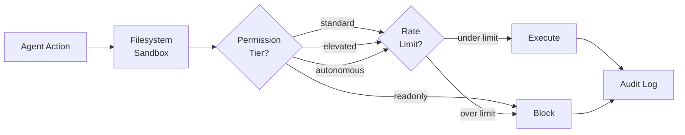

# Crux

> **Note:** This project is under active development and is not yet functional. APIs, commands, and configuration may change without notice.

A single-binary Go orchestrator that coordinates AI coding agents across tmux sessions with persistent memory, phase-based workflow enforcement, and vector-searchable decision tracking.

Crux manages Claude Code, Codex CLI, Gemini CLI, or any configurable CLI tool — assigning tasks from phase documents, enforcing verification gates between prompts, and maintaining a decision journal so the orchestrator never loses track of what agents are doing.

## Installation

### From Source

```bash
git clone https://github.com/roygabriel/crux.git
cd crux
make build
sudo make install
```

### Using `go install`

```bash
go install github.com/roygabriel/crux/cmd/crux@latest
```

### Curl Installer (Linux / macOS)

```bash
curl -fsSL https://raw.githubusercontent.com/roygabriel/crux/main/scripts/install.sh | sh
```

Requires **tmux** — install with your system package manager (`apt install tmux`, `brew install tmux`, etc.).

## Quick Start

```bash
# Initialize a project with the built-in example
crux init --example httpapi

# Start orchestration
crux start

# Check what's happening
crux status

# Search past decisions
crux decisions search "chose chi router over gorilla mux"

# View work notes for a phase
crux notes show 2a
```

## Shell Completions

```bash
# Bash
source <(crux completion bash)

# Zsh
crux completion zsh > "${fpath[1]}/_crux"

# Fish
crux completion fish | source
```

See `crux completion --help` for all options including permanent installation.

## Architecture



### How the Orchestrator Loop Works



Each iteration takes 1-2 seconds. The orchestrator polls tmux panes via `capture-pane`, parses agent output through plugin adapters, runs verification commands, and advances the phase engine. When making coordination decisions (reassigning work, resolving conflicts), it queries the decision journal for semantically relevant past decisions before acting.

### Two-Document Phase System

Every unit of work has two files — a phase spec and a prompt doc:



The engine never advances to Prompt N+1 until Prompt N's verification gates pass. Gates are real commands (`go build`, `go test`, `go vet`) that run in the project directory and check exit codes.

### Memory System

Three layers solving the orchestrator context loss problem:



Every decision made by any agent is recorded with context, rationale, and outcome. Before the orchestrator makes a coordination decision, it queries the vector index for semantically similar past decisions and injects them into its prompt. The orchestrator always knows what happened, even across sessions.

## Repository Layout

```
crux/
├── cmd/
│   └── crux/                     CLI entry point (cobra subcommands)
│       ├── main.go
│       ├── root.go               Global flags, config loading, logger setup
│       ├── start.go              Start orchestration loop
│       ├── status.go             Show world state
│       ├── init_cmd.go           Initialize project scaffolding
│       ├── decisions.go          Search/export decision journal
│       ├── notes.go              View/edit work notes
│       ├── phase.go              Phase management (create, validate, advance)
│       └── replay.go             Replay session transcripts
│
├── internal/
│   ├── config/                   YAML config + env overrides + validation
│   │   ├── config.go
│   │   ├── config_test.go
│   │   └── defaults.go
│   │
│   ├── tmux/                     Tmux session/pane management
│   │   ├── exec.go               Commander interface (testable)
│   │   ├── session.go            Create, list, kill sessions
│   │   ├── pane.go               Create, capture, send-keys
│   │   ├── sanitize.go           Input sanitization (injection prevention)
│   │   ├── watcher.go            Goroutine-based pane poller
│   │   └── *_test.go
│   │
│   ├── plugin/                   Agent plugin system
│   │   ├── interface.go          AgentPlugin interface definition
│   │   └── registry.go           Plugin registration + lookup
│   │
│   ├── agent/                    Agent lifecycle management
│   │   ├── registry.go           Agent instance registry
│   │   ├── lifecycle.go          Spawn, health check, kill
│   │   └── messenger.go          Send messages via tmux, parse responses
│   │
│   ├── memory/
│   │   ├── bank/                 File-based memory bank (6 markdown files)
│   │   │   ├── bank.go
│   │   │   └── templates.go
│   │   ├── store/                SQLite operational store
│   │   │   ├── store.go
│   │   │   └── migrations.go
│   │   ├── vector/               chromem-go wrapper
│   │   │   └── index.go
│   │   ├── journal/              Decision journal (record, search, export)
│   │   │   └── journal.go
│   │   ├── session/              Per-session context (persist, resume)
│   │   │   └── context.go
│   │   └── worknotes/            Per-phase work notes (auto-generate, update)
│   │       └── manager.go
│   │
│   ├── phase/                    Phase engine
│   │   ├── spec.go               Parse PHASE*.md specs
│   │   ├── prompt.go             Parse PHASE*-PROMPT.md contracts
│   │   ├── gate.go               Execute verification gates
│   │   ├── engine.go             Dependency graph, advancement, tracking
│   │   └── template.go           Prompt generation from templates
│   │
│   ├── orchestrator/             Main control loop
│   │   ├── orchestrator.go       Run loop, wire dependencies
│   │   ├── worldstate.go         Compact world state for prompts
│   │   ├── assignment.go         Agent-to-task assignment
│   │   └── decisionrag.go        Vector search context injection
│   │
│   ├── scaffold/                 Embedded default config + templates
│   │   ├── default-config.yaml
│   │   └── templates/
│   │
│   ├── wizard/                   Interactive init wizard (bubbletea)
│   │   └── wizard.go
│   │
│   ├── security/                 Safety enforcement
│   │   ├── sandbox.go            Filesystem path validation
│   │   ├── permissions.go        4-tier permission model
│   │   ├── audit.go              Structured JSON audit log
│   │   └── ratelimit.go          Per-agent command rate limiting
│   │
│   └── tui/                      Terminal dashboard (bubbletea)
│       ├── app.go
│       ├── agents.go             Agent status panel
│       └── logs.go               Log viewer panel
│
├── pkg/
│   ├── types/                    Shared types across packages
│   │   ├── agent.go
│   │   ├── message.go
│   │   ├── phase.go
│   │   ├── decision.go
│   │   ├── memory.go
│   │   ├── permission.go
│   │   └── errors.go
│   └── protocol/                 JSON message envelope
│       └── envelope.go
│
├── plugins/                      Agent CLI adapters
│   ├── claude/                   Claude Code adapter
│   │   ├── plugin.go
│   │   └── detect.go             Output pattern detection
│   ├── codex/                    OpenAI Codex CLI adapter
│   │   └── plugin.go
│   ├── gemini/                   Google Gemini CLI adapter
│   │   └── plugin.go
│   └── generic/                  Configurable regex-based adapter
│       └── plugin.go
│
├── docs/
│   ├── OVERVIEW.md               Architecture reference
│   └── phases/                   Phase specs + prompt docs
│       ├── INDEX.md              Dependency graph, reading order
│       ├── PHASE1A.md            Phase spec
│       ├── PHASE1A-PROMPT.md     Prompt-by-prompt execution contract
│       └── ...
│
├── CLAUDE.md                     Claude Code auto-detection instructions
├── LLM.md                        Detailed agent conventions
├── Makefile
├── go.mod
└── go.sum
```

## Configuration

Crux reads YAML from `.crux/config.yaml` with `CRUX_*` environment variable overrides:

```yaml
project:
  name: my-project
  root: .

agents:
  orchestrator:
    plugin: claude
    role: orchestrator
    permissions: elevated
  engineer-1:
    plugin: claude
    role: engineer
    permissions: standard
  engineer-2:
    plugin: codex
    role: engineer
    permissions: standard

memory:
  sqlite_path: .crux/memory.db
  vector_path: .crux/vectors/
  embedding_provider: ollama
  embedding_model: nomic-embed-text
  retention_days: 90

phases:
  spec_dir: docs/phases
  work_notes_dir: work-notes
  auto_commit: false
  gate_timeout: 60s

security:
  default_permission: standard
  allowed_paths: ["."]
  denied_paths: [".crux/secrets.env", ".git/"]
  audit_log: .crux/audit.log
  max_commands_per_min: 30
  max_files_per_session: 50
```

## Security Model



Four permission tiers control what each agent can do:

| Tier | File Write | Shell Commands | Network | Git Push |
|------|-----------|----------------|---------|----------|
| `readonly` | No | No | No | No |
| `standard` | Scoped paths | Allowlisted | No | No |
| `elevated` | Project root | Most commands | Localhost | Feature branches |
| `autonomous` | Project root | All non-destructive | Yes | Feature branches |

All agent commits land on feature branches (`crux/<agent-id>/<task>`). Merging to main requires human review.

## CLI

```
crux init                          Interactive wizard (when in a terminal)
crux init -y                       Non-interactive, use defaults
crux init --example httpapi        Seed with named example project
crux start                         Start orchestration loop
crux status                        Show world state (agents, phases, progress)
crux phase create --id 2a          Generate phase spec + prompt doc
crux phase validate                Verify all specs have exit criteria
crux phase advance 2a              Force-advance a phase (human override)
crux decisions search "query"      Semantic search across decision journal
crux notes show 2a                 Display work notes for a phase
crux replay <session-id>           Replay a session transcript
crux audit --since 24h             View audit log with filters
crux plan                          Interactive planning board
```

### Dashboard Keys (`crux start`)

```
Global:   q quit | ? help | tab / shift+tab focus panel
Agents:   j/k move | s pause/resume | x kill
Workspace:o output | d details | n notes | i message | a force-advance phase
Logs:     j/k scroll | pgup/pgdn page | / filter | g/G oldest/newest
```

### Planner Keys (`crux plan`)

```
Global:   q quit | ? help | tab focus | ctrl+g generate phases | ctrl+n reset
Panels:   j/k scroll | pgup/pgdn page
Input:    enter send message
```

## Design Principles

**Single binary, zero infrastructure.** `go build` produces one binary. SQLite for structured data, chromem-go for vectors, both embedded. No Postgres, no Redis, no Docker, no sidecar processes. `CGO_ENABLED=0`.

**Agents are plugins, not hardcoded.** Claude Code, Codex CLI, and Gemini CLI are adapters implementing the same interface. Adding a new CLI tool means writing one Go file with regex patterns for output detection.

**Phase docs are the source of truth.** The orchestrator reads the same markdown phase specs and prompt docs that a human would. It doesn't have a separate internal representation — the docs _are_ the program.

**Every decision is searchable.** The decision journal records what was decided, why, and what happened. Vector search surfaces relevant past decisions before the orchestrator makes coordination calls. No more "we already tried that approach in Phase 2 and it didn't work."

**Gates are non-negotiable.** The engine will not advance to the next prompt until `go build`, `go test`, and `go vet` pass. There is no "skip and fix later." If a gate fails, the agent is halted and the failure is logged.

## Documentation

Full documentation is available at [roygabriel.github.io/crux](https://roygabriel.github.io/crux/) or can be built locally:

```bash
cd site
npm install
npm start        # Start local dev server at http://localhost:3000/crux/
```

- [Architecture](site/docs/concepts/architecture.md) — six-layer stack overview
- [Configuration Reference](site/docs/reference/configuration.md) — every config key explained
- [Troubleshooting](site/docs/troubleshooting.md) — common issues and solutions

## Dependencies

All dependencies compile without CGO.

| Dependency | Purpose |
|-----------|---------|
| `ncruces/go-sqlite3` | SQLite via WASM (no CGO, no shared libs) |
| `philippgille/chromem-go` | Embedded vector database |
| `charmbracelet/bubbletea` | Terminal UI |
| `go-chi/chi/v5` | HTTP router (optional API) |
| `spf13/cobra` | CLI framework |
| `gopkg.in/yaml.v3` | YAML config |
| `RealAlexandreAI/json-repair` | LLM JSON output recovery |

## License

MIT
