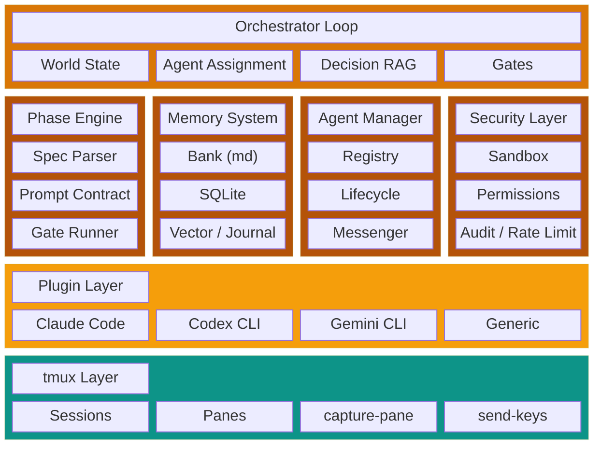

# Architecture

Crux is a single-binary Go CLI that orchestrates multiple AI coding agents running in tmux sessions. It enforces phase-based execution with persistent memory, verification gates, and vector-searchable decision tracking.

## Six-Layer Stack



### Layer 1: Orchestrator Loop

The top-level control loop polls agent panes, updates world state, checks for completed prompts, runs verification gates, and advances the phase engine. Each iteration takes 1-2 seconds.

### Layer 2: Phase Engine

Parses two-document phase specs (see [Phase System](./phase-system.md)), maintains the dependency graph, tracks prompt progress, and enforces gate passage before advancement.

### Layer 3: Memory System

Three-layer memory solving the orchestrator context loss problem. See [Memory System](./memory.md).

### Layer 4: Agent Manager

Manages agent lifecycle — spawning tmux sessions, monitoring health, sending structured messages, and parsing agent output through plugin adapters.

### Layer 5: Security Layer

Filesystem sandbox, four-tier permission model, structured audit logging, and per-agent rate limiting. See [Security Model](./security.md).

### Layer 6: Plugin Layer

Each CLI tool (Claude Code, Codex CLI, Gemini CLI) implements the `AgentPlugin` interface, translating between the orchestrator's structured protocol and the CLI's native I/O.

## Orchestrator Control Loop

```
1. Poll all agent panes (capture-pane every 1-2s)
2. Update world state (agent status, current task, last output)
3. Check for completed prompts (parse output markers)
4. For completed prompts:
   a. Run verification gates
   b. Update work notes
   c. Record decisions in journal
   d. Advance to next prompt or next phase
5. Check for errors/rate limits/hangs
   a. Retry, wait, or reassign as appropriate
6. For coordination decisions:
   a. Query decision journal (vector search) for relevant context
   b. Inject into orchestrator prompt
   c. Make decision with full context
7. Sleep, repeat
```

## World State

A compact JSON summary (~200 tokens) always present in the orchestrator's prompt:

```json
{
  "phase": "2b",
  "agents": {
    "claude-1": { "status": "busy", "prompt": "2/4", "task": "core types" },
    "codex-1": { "status": "idle", "prompt": "3/4", "task": "API endpoint" }
  },
  "gates_passed": ["go build", "go vet"],
  "gates_pending": ["go test"],
  "decisions_today": 7,
  "open_questions": 2
}
```

## Communication Protocol

Structured JSON envelopes sent via tmux `send-keys`:

```json
{
  "id": "msg-uuid",
  "from": "orchestrator",
  "to": "engineer-1",
  "type": "task",
  "priority": "normal",
  "payload": {
    "phase": "2a",
    "prompt": 2,
    "context_files": ["internal/types/types.go"],
    "task": "Implement core orchestration types"
  },
  "timestamp": "2026-02-17T12:00:00Z"
}
```

## Agent Plugin Interface

Each CLI adapter implements:

```go
type AgentPlugin interface {
    Name() string
    LaunchCmd(cfg AgentConfig) (bin string, args []string, err error)
    DetectReady(paneContent string) bool
    DetectBusy(paneContent string) bool
    DetectError(paneContent string) (string, bool)
    DetectRateLimit(paneContent string) (time.Duration, bool)
    FormatMessage(msg Message) string
    ParseOutput(paneContent string) (AgentOutput, error)
    Capabilities() []Capability
}
```

Four adapters ship with Crux: Claude Code, Codex CLI, Gemini CLI, and a configurable Generic adapter for any CLI tool.

## Parallel Execution

Multiple agents can work simultaneously when their phases have non-overlapping file sets. The engine validates:

- `FilesNew` and `FilesModified` sets are disjoint across parallel phases
- Each parallel agent gets a separate git branch
- If conflicts are detected, the later-assigned agent is halted
